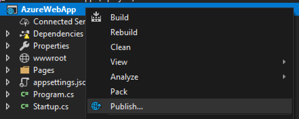

## Introduction
Azure est la plateforme d’infonuagique de Microsoft. Dans la même famille qu’Amazon Web Services (AWS), Google Cloud et plusieurs autres. Microsoft Azure supporte, entre autres, le type Platform-as-a-Service (PaaS). C’est-à-dire qu’il est possible de bâtir une solution en utilisant seulement les services offerts par cette plateforme, sans avoir à gérer des serveurs individuellement. Il est aussi possible d’utiliser Microsoft Azure pour louer des serveurs et de les gérer soi-même si c’est ce que l’on désire. Dans ce cas, on parlera d’Infrastructure-as-a-Service (IaaS).  
[https://azure.microsoft.com/](https://azure.microsoft.com/){:target="_blank"}

## Déploiement sur Azure
Il y a plusieurs façons de [déployer une application](https://docs.microsoft.com/en-us/visualstudio/deployment/quickstart-deploy-to-azure){:target="_blank"}. Nous allons voir comment fonctionne Azure App Service.

### Créer l’App Service
Lors de la première publication, Visual Studio nous offrira de créer le App Service.
Afficher le menu contextuel du projet et sélectionner "Publier..."

 
Sélectionner le type de publication "App Service"

 
Configurer l’application Azure
-	Nom: Dois être disponible sur Azure et représenter votre application
-	Abonnement: La plan Azure à utiliser, le mode de paiement.
-	Groupe de ressources: Le groupe de ressources sert à garder les différentes ressources ensemble, physiquement prêt pour qu’elles aient une proximité et réduire les délais d’accès.
-	Plan d’hébergement: Le coût du service. Il existe des plans gratuits, mais il faut faire attention, car ce n’est pas celui par défaut.
-	Application Insights: Génère des statistiques d’utilisation et peut aider à identifier des problèmes en amont ou lorsqu’ils surviennent.


 
### Publier sur l’App Service
Il suffit de cliquer sur "Publier"

 
## Stockage par Blob
Le [stockage](https://docs.microsoft.com/en-us/azure/storage/){:target="_blank"} par Blob est une façon parmi tant d’autres de conserver vos fichiers dans l’infonuagique. Ce type de stockage comporte plusieurs avantages, tels que la redondance, le paiement à l’utilisation et la possibilité de stocker de très gros fichiers.

Avant de pouvoir utiliser le stockage, vous devez avoir un compte de stockage, à créer sur le portail Azure.


La façon dont les données sont structurées sont très similaire à un système de fichier. Chaque Blob doit être dans un conteneur et en utilisant le "/", dans le nom du blob, vous pourrez simuler l’appartenance à un répertoire.

### Exemple simple d’utilisation

1. Créer un compte de stockage sur le portail Azure
2. Installer Microsoft.Azure.Storage.Blob sur le projet
3. Téléverser un fichier
```cs
CloudStorageAccount compte = CloudStorageAccount.Parse(<Connection>);
CloudBlobClient blobClient = compte.CreateCloudBlobClient();
CloudBlobContainer conteneur = blobClient.GetContainerReference(<Nom>);
CloudBlockBlob blob = conteneur.GetBlockBlobReference(<Nom>);
await conteneur.CreateIfNotExistsAsync();
await blob.UploadFromStreamAsync(<stream>);
```
4. Modifier les attributs d'un fichier
```cs
CloudStorageAccount compte = CloudStorageAccount.Parse(<Connection>);
CloudBlobClient blobClient = compte.CreateCloudBlobClient();
CloudBlobContainer conteneur = blobClient.GetContainerReference(<Nom>);
CloudBlockBlob blob = conteneur.GetBlockBlobReference(<Nom>);
blob.Properties.ContentType = Input.ImageProfil.ContentType;
await blob.SetPropertiesAsync();
```
5. Retourner un blob comme réponse
```cs
CloudStorageAccount compte = CloudStorageAccount.Parse(_config.GetConnectionString("BlobStorage"));
CloudBlobClient blobClient = compte.CreateCloudBlobClient();
CloudBlobContainer conteneur = blobClient.GetContainerReference("musique");
CloudBlockBlob blob = conteneur.GetBlockBlobReference($"{user.Id}");
await blob.FetchAttributesAsync();
return new FileStreamResult(await blob.OpenReadAsync(), blob.Properties.ContentType);
```

Plusieurs autres opérations sont disponibles avec l’API.
- [Stockage Azure](https://docs.microsoft.com/en-us/dotnet/api/overview/azure/storage?view=azure-dotnet){:target="_blank"}
- [Stockage Blob](https://docs.microsoft.com/en-us/dotnet/api/microsoft.windowsazure.storage.blob?view=azure-dotnet){:target="_blank"}
 