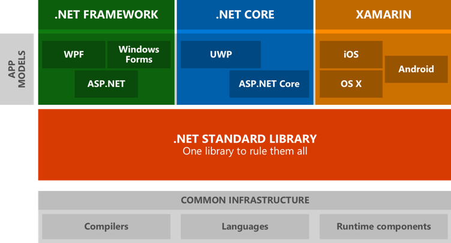

## Introduction

ASP.NET utilise le Framework .NET, dont la création de la version 1.0 remonte à 2002. Dans la révision de ces plateformes, Microsoft a décidé de lancer .NET Standard et .NET Core.

.NET Core est une nouvelle implémentation du Framework .NET dont l’objectif et de créer des applications multiplateformes. C’était aussi l’idée originale du .NET Framework, mais elle ne s’est jamais vraiment popularisée. 

.NET Standard est en ensemble d’API qui doit être implémenté par chaque implémentation de .NET. En ciblant .NET Standard, on s’assure que notre librairie pourra être utilisé par chacune des implémentations.




## Traitement des requêtes

Lorsqu’une requête est reçue par l’application, c’est un système de chaine de commandes qui décide par quoi et comment la requête sera traitée. L’ordre dans lequel les routes sont activées est important puisque c’est dans cet ordre que les pages seront traitées.

### UseMvc()

  Cette méthode active les pages Razor et MVC. Lorsqu’on utilise le système MVC, un routage par défaut existe pour les pages de type Razor. Pour l’utiliser, il suffit de créer un répertoire “Pages” dans le projet et les routes auront le nom des répertoires et des pages *.cshtml. Les pages Index.cshtml sont les pages par défaut pour l’accès à un répertoire.

  ```cs
  public void Configure(IApplicationBuilder app)
  {
    app.UseMvc();
    app.Run(async (context) =>
    {
        await context.Response.WriteAsync("Hello World!");
    });
  }
  ```
  
 
## Dependency Injection
Le système de dépendance d’ASP.NET intègre le patron d’injection de dépendances. Pour fonctionner, on créera habituellement l’interface du service (optionnelle) et son implémentation.
```cs
interface IMaDependance {

}

class MaDependance : IMaDependance {

}
```

Pour rendre la classe accessible au système, il faut l’enregistrer dans la fonction ConfigureServices.
```cs
public void ConfigureServices(IServiceCollection services)
{
    // Enregistre l'utilisation de l'interface IMaDependance
    services.AddScoped<IMaDependance>(serviceProvier => new Maeépendance());
    // Enregistre l'utilisation de MaDependance
    services.AddScoped<MaDependance>();
    // Enregistre l'utilisation de MaDependance comme singleton
    services.AddSingleton<MaDependance>();
}
```

## Paramètres
On peut ajouter un fichier `appsettings.json` au niveau racine du projet. L’objectif de ce fichier est de pouvoir changer le comportement ou de reconfigurer l’application rapidement. C’est également le mécanisme à utiliser lorsqu’on déploie pour divers environnements: développement, test, staging, production, ... Le contenu du fichier est du JSON standard.

Exemple :
```json
{
  "ConnectionString": "...",
  "Messages": {
    "Saluer": "Bonjour"
  }
}
```

### Accès aux paramètres
Pour accéder aux paramètres, il faut d’abord obtenir une référence à l’objet de configuration. 
Dans une page Razor :

```cs
@inject Microsoft.Extensions.Configuration.IConfiguration config
```

Ensuite, on peut accéder aux paramètres comme si c’était un dictionnaire. On peut accéder à plusieurs niveaux en créant un chemin d’accès avec des `:`. Le nom des paramètres n’est pas sensible à la case et les valeurs doivent être des strings.

```cs
@config["ConnectionString"]
@config["Messages:Saluer"]
```

###	Configuration POCO
On peut aussi associer la configuration ou une section à une classe de configuration pour ne pas avoir à utiliser les clés sous forme de chaîne de caractères.

1. Se créer une classe.
   ```cs
   class Messages {
     public string Saluer { get; set; }
   }
   ```
2. Instancier la classe
   ```cs
   Messages messages = new Messages();
   ```
3. Initialiser la classe avec la configuration.
   ```cs
   config.GetSection("messages").Bind(messages);
   ```

### Auto-Configuration POCO
On peut pousser plus le concept un peu plus loin pour simplifier son utilisation: 
```cs
public class Messages {
  public Messages(IConfiguration config) {
    config.GetSection("messages").Bind(this);
  }

  public string Saluer { get; set; }
}
```

## Environnement
L’environnement permet de changer les paramètres facilement. On utilise une variable d’environnement pour ce faire: `ASPNETCORE_ENVIRONMENT`.

Les valeurs standards sont:
  -	Development
  - Staging
  - Production (par défaut)

On peut aussi créer un fichier de paramètres par environnement `appsettings.{environnement}.json`. Les paramètres de l’environnement seront appliqués par-dessus ceux du fichier par défaut. On peut donc y inclure que les paramètres qui changent selon la configuration.

###	IHostingEnvironment
L’interface possède quelques fonctions utilitaires pour déterminer facilement quel est l’environnement utilisé ([Documentation officielle](https://docs.microsoft.com/en-us/dotnet/api/microsoft.aspnetcore.hosting.ihostingenvironment?view=aspnetcore-2.1){:target="_blank"})

