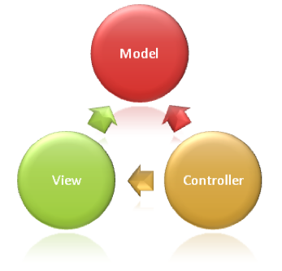

## Introduction

https://docs.microsoft.com/fr-ca/aspnet/core/mvc/overview?view=aspnetcore-2.1

 
L’objectif de l’architecture Modèle-Vue-Contrôleur est de bien séparer les différentes préoccupations (concerns) afin de faciliter la maintenance. Autant que possible, chaque objet ne doit avoir qu’une seule préoccupation.

### Modèle
Si vous regardez le diagramme, vous remarquerez que les relations vont vers le modèle. Avec ce type d’architecture, c’est le modèle qui est à la partie commune aux deux autres composants. L’avantage de cette séparation est de pouvoir tester la vue sans avoir besoin d’un contrôleur. 
Le modèle représente les données nécessaires au fonctionnement de l’application. Le modèle peut aussi contenir quelques règles de logique. Les différentes classes du modèle sont habituellement dans un répertoire `Models`, mais peuvent être conservées ailleurs.

### Vue
La vue, elle, sert à afficher les données et à donner les points d’accès aux différentes fonctionnalités de l’application. Dans ASP.NET Core, la vue utilise l’engin Razor et devrait avoir un minimum de logique pour se concentrer sur les informations à afficher. Si trop de règles logiques se retrouvent dans une vue, on devrait probablement séparer la vue pour utiliser une vue partielle ou un `ViewComponent`. La vue est représentée par un fichier `.cshtml`, dans le répertoire `Views`.

### Contrôleur
Le contrôleur sert à gérer les différentes vues. C’est lui qui reçoit actions de l’utilisateur et fait le lien entre les données et la vue. Par exemple, il récupérera les données à afficher et les enverras à la vue. Il s’agit d’un fichier `.cs`.  
Les actions que supporte le contrôleur sont des méthodes publiques. Par exemple, un contrôleur qui gèrent les plantes pourrait avoir les fonctions Index, Détails, Modifier, Créer, Supprimer. Les contrôleurs sont habituellement dans le répertoire `Controllers` et ils héritent de la classe `Microsoft.AspNetCore.Mvc.Controller`. Le nom du contrôleur est associé à sa route. Par exemple, un `PlantesController` sera accessible via `/plantes`.

## Routes
Lorsqu’on crée un nouveau projet MVC, la règle de route suivante est ajoutée par défaut.
```cs
app.UseMvc(routes =>
{
  routes.MapRoute(
    name: "default",
    template: "{controller=Home}/{action=Index}/{id?}");
});
```

Par défaut, le contrôleur est `Home`, l’action est `Index` et le `id` est optionnel.

| URL                   | Contrôleur        | Action   |
|:--------------------- |:----------------- |:-------- |
| /Home/Index           | HomeController    | Index    |
| /Home                 | HomeController    | Index    |
| /                     | HomeController    | Index    |
| /Plantes/Nouvelle     | PlantesController | Nouvelle |
| /Plantes              | PlantesController | Index    |
| /Plantes/Modifier/45	| PlantesController | Modifier |


Si les règles de routes par défaut ne sont pas exactement celles que nous désirons, nous pouvons en créer de nouvelles, ou utiliser des attributs sur les contrôleurs ou les actions.

### Attribut Route
L’attribut Route peut être utiliser sur les contrôleurs et/ou les actions. S’il est utilisé sur les deux, ils seront combinés ensemble.

### Attribut Http{Méthode}
Aussi en combinaison avec l’attribut Route, il est possible de définir la méthode de l’action avec un attribut.
```cs
[Route("musique/[action]/{id?}")]
public class MusicController : Controller
{
  // GET: musique
  [Route("/musique")]
  // GET: musique/index
  public ActionResult Index() { ... }

  // GET: musique/details/5
  public ActionResult Details(int id) { ... }

  // GET: musique/create
  public ActionResult Create() { ... }

  // POST: musique/create
  [HttpPost]
  public ActionResult Create([Bind()] Album album) { ... }
}
```
### Lien
Les Tag Helpers suivants peuvent être utilisés pour rediriger vers une action de contrôleur.
```html
<a asp-controller="controlleur" asp-action="action" asp-route-id="@Model.Id">Lien</a>
```

### Afficher une vue
Quand un contrôleur est appelé, c’est lui qui décide quelle vue sera affichée. Par défaut, le code suivant affichera une vue ayant le même nom que le l’action, dans le répertoire du nom du contrôleur. Si la vue nécessite un modèle, il peut être passer en paramètre. On peut aussi donner le nom de la vue à utiliser en paramètre.
```cs
public ActionResult Index()
{
  if (config.Mode == "Complet")
    return View("Complet", data); // [Views]/[contrôleur]/Index.cshtml
  else if (config.Mode == "Sommaire")
    return View("Sommaire");      // [Views]/[contrôleur]/Sommaire.cshtml
  else if (config.Mode == "Données")
    return View(data);            // [Views]/[contrôleur]/Index.cshtml
  else
    return View();                // [Views]/[contrôleur]/Index.cshtml
}
```
[Plus d'infos sur le routage](https://docs.microsoft.com/en-us/aspnet/core/fundamentals/routing){:target="_blank"}

## Envoyer de l’information aux vues
### Modèle
Comme vue précédemment, on peut utiliser le modèle pour transférer des données vers la page.
### Modèle de vue (ViewModel)
Il est aussi possible de créer une classe spécifique pour la gestion de la page. Ce modèle fonctionne de la même façon qu’un modèle associé à des données, mais pourrait contenir plus d’information.
### ViewData
L’objet `ViewData` peut également être utiliser pour transférer de l’information du contrôleur vers la vue. Il s’agit simplement d’un dictionnaire, ce qui donne une très grande flexibilité.

## Contenu
Il est possible de retourner d’autres types de contenu que du HTML comme nous l’avons vu.

#### Retourner une chaîne de caractère
```cs
public string String()
{
  return "Bonjour";
}

public IActionResult StringActionResult()
{
  return new ContentResult() { Content = "Bonjour (Action Result)" };
}
```
#### Retourner un objet
```cs
public Album Json()
{
  return new Album();
}
```

[Liste complète](https://docs.microsoft.com/en-us/dotnet/api/microsoft.aspnetcore.mvc.actionresult){:target="_blank"}

## Web API
Le Web API fonctionne sous le même principe que MVC. Toutefois, au lieu de retourner des pages, lorsqu’on utiliser un Web API, on utilise plutôt le langage web pour créer une application.
La classe de base d’un contrôleur API est [`ControllerBase`](https://docs.microsoft.com/en-ca/dotnet/api/microsoft.aspnetcore.mvc.controllerbase){:target="_blank"} au lieu de `Controller`


