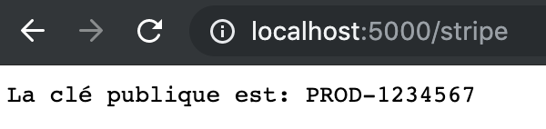

## Objectifs

- Utilisation des environnements de déploiement
- Configurer différemment les différents environnements de déploiement
- Utiliser l'injection de dépendance

## Travail à effectuer

1. Démarrez un nouveau projet ASP.NET vide (Empty) en utilisant Visual Studio ou la commande `dotnet new web`
2. À l'aide du `appsettings.json`, ajoutez les paramètres de configuration pour la clé publique et la clé privée.
   Vous devez donc avoir un objet `stripe` qui contient les paramètres `CléPublique` et `CléPrivée` (choisissez des valeurs par défaut).
3. Lorsque le `path` de la requête est `/stripe`, affichez "La clé publique est: [Clé publique ici]"
4. Modifiez le projet de façon à avoir la clé publique "DEV-ABCDEFG" lorsque vous êtes en mode développement et "PROD-1234567" lorsque l'application s'exécute en mode production.
5. Créez un objet pour configurer et accéder de façon typée à ces paramètres.

## Résultat final
Vous devriez être capable de voir ceci lorsque vous êtes en mode 

### À l'étape 1
Vous devriez avoir ceci comme résultat

### À l'étape 3
Vous devriez pouvoir obtenir ceci lors que vous exécutez l'application en mode "Développement"

### À l'étape 4
Vous devriez pouvoir obtenir ceci lorsque vous exécutez l'application en mode "Production", tout en conservant les mêmes résultats précédents

À l'étape 5, rien ne devrait changer le résultat, mais le code devrait être mieux structuré.
